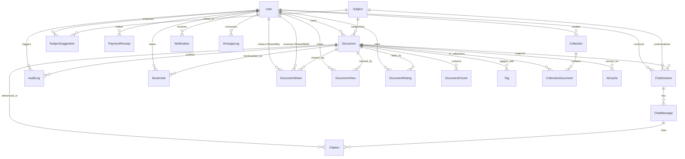

# Database Schema & Entity Relationship Design
## Project: Lumis (Academic Document Management & AI Synthesis Platform)

> **Phiên bản Schema:** 2.0 — Cập nhật lần cuối: 2026-07-03  
> Thiết kế dùng **PostgreSQL** + **pgvector** (Supabase hosted). Prisma v5.22.0.

---

## 1. Entity Relationship Diagram (ERD)



---

## 2. Danh sách Bảng & Mô tả

### Nhóm 1: Authentication
| Bảng | Mô tả |
|:---|:---|
| `users` | Tài khoản người dùng (Student / Admin). Hỗ trợ cả Password và Google SSO (`passwordHash` nullable). |
| `one_time_passwords` | Mã OTP xác thực email khi đăng ký. Hết hạn sau 10 phút, giới hạn 3 lần thử. |

### Nhóm 2: Tài liệu (Documents)
| Bảng | Mô tả |
|:---|:---|
| `documents` | Metadata tài liệu. Hỗ trợ soft delete (`deletedAt`), deduplication (`fileHash`), moderation workflow. Thêm `thumbnailUrl` cho Guest preview. |
| `document_chunks` | Đoạn văn bản cắt nhỏ từ file + vector embedding `vector(1536)` cho RAG semantic search. |
| `document_views` | Ghi nhận mỗi lượt xem tài liệu (cả Guest và Student). Phục vụ Dashboard thống kê Admin. |
| `document_ratings` | Đánh giá tài liệu 1-5 sao + bình luận. Mỗi user chỉ đánh giá 1 lần/tài liệu. |
| `document_shares` | Chia sẻ tài liệu riêng tư giữa 2 user cụ thể với mức quyền: `view / comment / edit`. |

### Nhóm 3: Môn học (Subjects)
| Bảng | Mô tả |
|:---|:---|
| `subjects` | Danh sách môn học do Admin quản lý (mã `code` là duy nhất). |
| `subject_suggestions` | Đề xuất môn học mới từ sinh viên, chờ Admin duyệt. |
| `tags` | Tag tự do gắn vào tài liệu (nhiều-nhiều với `documents`). |

### Nhóm 4: AI Chat & RAG
| Bảng | Mô tả |
|:---|:---|
| `chat_sessions` | Phiên chat AI. Hỗ trợ 3 scope: `SINGLE_DOCUMENT / SUBJECT / GLOBAL`. |
| `chat_messages` | Lịch sử tin nhắn trong từng phiên chat. |
| `citations` | Trích dẫn nguồn đoạn văn bản cụ thể AI dùng để trả lời (trang + đoạn). |
| `ai_usage_logs` | Ghi nhận mỗi lượt gọi AI (tokens in/out). Phục vụ rate limit Free=10/ngày, Premium=50/ngày. |
| `ai_cache` | Cache câu trả lời AI theo `queryHash`. Hết hạn sau số ngày cấu hình trong `system_configs`. Tiết kiệm chi phí OpenAI. |

### Nhóm 5: Tổ chức cá nhân
| Bảng | Mô tả |
|:---|:---|
| `bookmarks` | Sinh viên lưu tài liệu yêu thích. Unique constraint `(userId, documentId)`. |
| `collections` | Bộ sưu tập tài liệu cá nhân do người dùng tự đặt tên. |
| `collection_documents` | Bảng liên kết nhiều-nhiều giữa `collections` và `documents`. |

### Nhóm 6: Hệ thống & Vận hành
| Bảng | Mô tả |
|:---|:---|
| `system_configs` | Cấu hình hệ thống động do Admin chỉnh sửa qua UI (không cần redeploy). VD: giới hạn file, rate limit AI. |
| `audit_logs` | Nhật ký hành động Admin (moderation, thay đổi quyền, xóa dữ liệu, v.v.). |
| `notifications` | Thông báo in-app gửi đến người dùng (tài liệu được duyệt/từ chối, v.v.). |
| `payment_receipts` | Lịch sử giao dịch thanh toán nâng cấp tài khoản lên Premium. |

---

## 3. Chi tiết Bảng Quan Trọng

### `system_configs` — Cấu hình Admin không cần redeploy
| Key | Giá trị mặc định | Mô tả |
|:---|:---:|:---|
| `max_file_size_mb` | `50` | Dung lượng file tối đa (MB) |
| `allowed_mime_types` | `[pdf, docx, txt, png, jpg]` | Định dạng file được phép upload |
| `free_ai_limit_per_day` | `10` | Giới hạn lượt AI/ngày cho tài khoản Free |
| `premium_ai_limit_per_day` | `50` | Giới hạn lượt AI/ngày cho tài khoản Premium |
| `ai_cache_ttl_days` | `7` | Số ngày cache câu trả lời AI |
| `soft_delete_retention_days` | `30` | Số ngày giữ file đã xóa mềm trước khi hard delete |
| `max_uploads_per_day` | `20` | Số file upload tối đa/ngày/user |

### `document_chunks` — Vector Store cho RAG
- **`embedding`**: kiểu `vector(1536)` (Unsupported trong Prisma, tạo qua raw SQL)
- **Index**: HNSW cosine distance (`document_chunks_embedding_idx`)
- **Metadata**: JSON chứa `{ documentId, pageNumber, chunkIndex }` phục vụ n8n Supabase Vector Store node

### `ai_cache` — Tiết kiệm chi phí OpenAI
- **`queryHash`**: SHA-256 của `(documentId + normalized_question)` — unique key
- **`expiresAt`**: Timestamp hết hạn cache, đọc từ `system_configs.ai_cache_ttl_days`
- **`hitCount`**: Số lần cache được tái sử dụng (metric cho Admin dashboard)

---

## 4. Các chỉ số Index quan trọng

| Bảng | Columns được Index | Mục đích |
|:---|:---|:---|
| `documents` | `(status, deletedAt)` | Lọc tài liệu APPROVED chưa xóa nhanh |
| `document_chunks` | `embedding` (HNSW) | Vector similarity search cho RAG |
| `document_views` | `(documentId, viewedAt)`, `(userId, viewedAt)` | Dashboard thống kê theo ngày |
| `ai_usage_logs` | `(userId, usedAt)` | Đếm số lượt dùng AI trong ngày |
| `ai_cache` | `queryHash` (unique), `(documentId)`, `(expiresAt)` | Lookup cache nhanh + dọn cache hết hạn |
| `document_ratings` | `(documentId, userId)` unique | 1 rating/user/tài liệu |

---

## 5. Sơ đồ Vòng đời Tài liệu (Document Lifecycle)

```
[Upload] → PRIVATE → APPROVED (auto, dùng AI ngay)
         → PUBLIC  → PENDING → APPROVED (Admin duyệt, hiển thị toàn trường)
                             → REJECTED (Admin từ chối + lý do)

[Xóa] → deletedAt set (Soft Delete, ẩn khỏi UI)
       → Sau 30 ngày (system_configs.soft_delete_retention_days)
       → Cron Job Hard Delete (xóa file khỏi Cloud Storage)
```

---

## 6. Lệnh Setup Database

```bash
# Bật pgvector + thêm cột embedding (chạy 1 lần duy nhất trên DB mới)
node src/scripts/setup-vector.js

# Sync toàn bộ schema lên Supabase
npx prisma db push

# Generate Prisma Client sau khi thay đổi schema
npx prisma generate

# Seed dữ liệu mặc định cho system_configs
node prisma/seed.js
```
